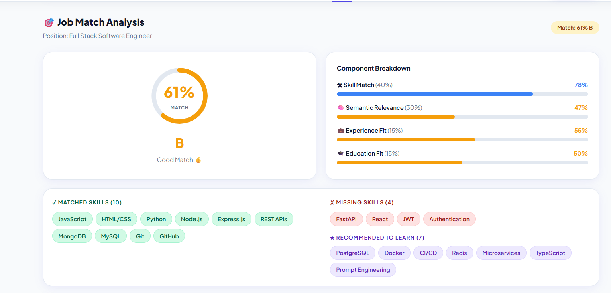

# ResumeAI 🚀

> An intelligent, full-stack Resume Analysis and Parsing Platform designed to help job seekers optimize their resumes for Applicant Tracking Systems (ATS) and specific Job Descriptions.

**Live Demo:** [https://resumeai-sir1.onrender.com](https://resumeai-sir1.onrender.com)

---

## 🌟 Key Features

### 📊 ATS Score Dashboard
Get a comprehensive breakdown of your resume's tier, completeness, and section-by-section ATS score. Identify top strengths and critical risks to improve your recruiter readiness.



### 🎯 Job Match Analysis
Compare your resume directly against a target Job Description. The platform provides:
- Overall match percentage.
- Granular component breakdowns (Skill Match, Semantic Relevance, Experience Fit, Education Fit).
- A detailed gap analysis of missing vs. matched skills.


### 🧠 AI-Powered Enhancements
Leverages the Gemini API for intelligent resume improvements:
- Bullet point refinement.
- Project enhancement suggestions.
- Tailored interview preparation.

---

## 🏗️ Architecture & Tech Stack

ResumeAI is built as a monolithic application prioritizing performance and low memory footprint.

- **Backend:** 
  - **FastAPI** (Python 3) for high-performance REST APIs.
  - **ONNX Runtime** for semantic matching (using `all-MiniLM-L6-v2`), bypassing PyTorch overhead to keep memory usage under 450MB.
  - **pdfplumber** for accurate PDF text extraction.
- **Frontend:** 
  - HTML5, Vanilla JavaScript, and CSS variables for a lightweight, React-style UI without the bundle size.
- **Database:** 
  - **SQLAlchemy ORM** connecting to **Neon PostgreSQL** (Production) or **SQLite** (Development).
- **Authentication:** JWT-based authentication using PyJWT.

---

## 🚀 Getting Started

### Prerequisites
- Python 3.9+

### Local Installation

1. **Clone the repository:**
   ```bash
   git clone https://github.com/AbhijaySinghPanwar/resumeAI.git
   cd resumeAI
   ```

2. **Set up a virtual environment:**
   ```bash
   python -m venv venv
   source venv/bin/activate  # On Windows use `venv\Scripts\activate`
   ```

3. **Install dependencies:**
   ```bash
   pip install -r requirements.txt
   ```

4. **Environment Variables:**
   Create a `.env` file in the root directory (or in `resumeai_app/`) and configure the necessary keys like your Gemini API Key and JWT Secret.

5. **Run the Application:**
   ```bash
   cd resumeai_app
   uvicorn main:app --reload
   ```
   The backend API and the statically served frontend will be available at `http://localhost:8000`.

### Further Documentation
- **Core Parser Library:** Check out `resumeai/README.md`.
- **System Design:** Dive into `ARCHITECTURE.md` for an in-depth look at the infrastructure.

---

## 🛡️ License

This project is licensed under the MIT License.
